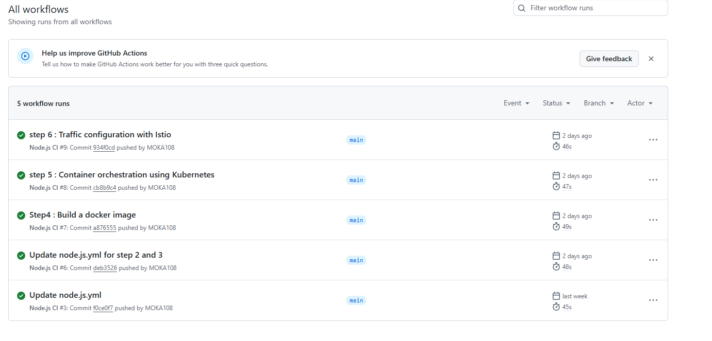
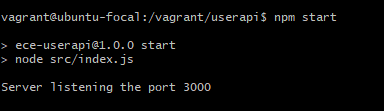
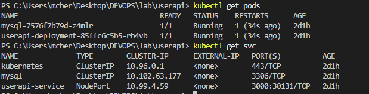

# User API DevOps Project

## Overview

This project demonstrates a full DevOps workflow for a Node.js REST API with a MySQL backend. It covers local development, automated testing, CI/CD with GitHub Actions, VM provisioning (Vagrant + Ansible), Dockerization, Kubernetes deployment, and Istio service mesh. The documentation below guides you through each environment and step.

---

## Features

- Node.js REST API for user management (CRUD)
- MySQL database integration
- Health check endpoint (`/health`)
- Unit, integration, and API tests (Mocha, Chai)
- CI/CD with GitHub Actions
- Infrastructure as Code: Vagrant & Ansible
- Docker containerization
- Kubernetes manifests for deployment, service, and persistent storage
- Istio service mesh with traffic shifting
- Step-by-step instructions for all environments

---

## Project Structure

```
README.md
screenshots/
  local.png
  vm.png
  docker.png
  k8s.png
  istio.png
iac/
  Vagrantfile
  app.log
  package.json
  ubuntu-bionic-18.04-cloudimg-console.log
  playbooks/
    provision.yml
    schema.sql
istio/
  destinationrule.yaml
  virtualservice.yaml
k8s/
  mysql-deployment.yaml
  userapi-deployment.yaml
  userapi-service.yaml
userapi/
  Dockerfile
  package.json
  conf/
    default.json
    default.json.save
  src/
    configure.js
    dbClient.js
    index.js
    controllers/
      user.js
    routes/
      user.js
  test/
    configure.js
    dbClient.js
    user.controller.js
    user.router.js
.github/
  workflows/
    node.js.yml
```

---

## Architecture Diagram


---

## Setup & Usage

### 1. Local Development

This step focuses on setting up and running the application in a developer's local environment. It allows you to develop, test, and debug the Node.js API before deploying it to other environments. The main tasks include installing dependencies, configuring the database, starting the application, and verifying that the endpoints work as expected. This phase ensures that all core features are functional and that the codebase is ready for further automation and deployment.

#### Prerequisites
- Node.js (LTS)
- MySQL

#### Steps
1. Clone the repository:
   ```bash
   git clone https://github.com/MOKA108/DEVOPS-Project.git
   cd lab/userapi
   ```
2. Install dependencies:
   ```bash
   npm install
   ```
3. Configure MySQL:
   - Start MySQL and create a database (e.g., `userapidb`).
   - Import schema:
     ```bash
     mysql -u root -p userapidb < ../iac/playbooks/schema.sql
     ```
   - Update `conf/default.json` with your DB credentials.
4. Start the app:
   ```bash
   npm start
   ```
5. Test endpoints:
   - Use [Postman](https://www.postman.com/) to send requests to your API endpoints (e.g., POST /user, GET /health).
   - Import your API collection or create requests manually in Postman.
   - Example:
     - POST http://localhost:3000/user with JSON body `{ "username": "alice", "firstname": "Alice", "lastname": "Smith" }`
     - GET http://localhost:3000/health


### 2. Automated Testing

This step ensures the reliability and correctness of the application by running automated tests. It covers unit, integration, and API tests using Mocha and Chai. Running these tests helps catch bugs early and validates that all features work as intended before moving to deployment or further automation.

From `userapi/`:
```bash
npm test
```

---

### 3. CI/CD with GitHub Actions

GitHub Actions automates the process of testing, building, and deploying your application. For this project, every major commit triggers the workflow to ensure code quality and up-to-date Docker images. The workflow file is located at `.github/workflows/node.js.yml` and runs tests and builds the Docker image on each push. Docker Hub credentials are required as secrets (see workflow file for details).


---

### 4. VM Provisioning (Vagrant + Ansible)

This step automates the creation and configuration of a virtual machine for the application using Vagrant and Ansible. It provisions a Linux VM, installs all required software (Node.js, MySQL, and the app), and sets up the environment to closely match production. This allows for consistent, repeatable deployments and easy testing in an isolated environment.

#### Prerequisites
- Vagrant
- VirtualBox

#### Steps
1. From `iac/`:
   ```bash
   vagrant up
   ```
   
  
   

2. VM will be provisioned with Node.js, MySQL, and the app using Ansible (`playbooks/provision.yml`).
3. SSH into the VM:
   ```bash
   vagrant ssh
   ```
   (screenshots/vagrantssh.png)

4. Once connected, navigate to the app directory:
   ```bash
   cd /vagrant/userapi
   ```
5. You can now start the app from this directory. (See Vagrantfile for port mapping.)





---

### 5. Docker

This step packages the application and its dependencies into a Docker container, ensuring consistency across different environments. By building and running the Docker image, you can easily deploy and test the app locally or in the cloud. Pushing the image to Docker Hub makes it accessible for orchestration platforms like Kubernetes.

You can access to the Docker image with this link : https://hub.docker.com/r/mariecb/userapi/tags

#### Prerequisites
- Docker

#### Steps
1. Build the image (from `userapi/`):
   ```bash
   docker build -t mariecb/userapi:latest .
   ```
2. Run the container:
   ```bash
   docker run -d -p 3000:3000 --env-file conf/default.json mariecb/userapi:latest
   ```
3. Push to Docker Hub:
   ```bash
   docker push mariecb/userapi:latest
   ```


---

### 6. Kubernetes & Minikube

This step deploys the application and its database to a Kubernetes cluster, providing scalability, resilience, and simplified management. Kubernetes manifests define the deployments, services, and persistent storage, allowing you to orchestrate and monitor your app in a production-like environment.


#### Prerequisites
- kubectl
- Kubernetes cluster (e.g., Minikube, Docker Desktop)

#### Steps
1. Apply manifests (from `k8s/`):
   ```bash
   kubectl apply -f mysql-deployment.yaml
   kubectl apply -f userapi-deployment.yaml
   kubectl apply -f userapi-service.yaml
   ```
2. Check pods and services:
   ```bash
   kubectl get pods,svc
   ```
3. Access the app via the NodePort or LoadBalancer service.

Below, you can see the application running in Minikube:

- Pods and services:
 

 

- Access via NodePort:
  

  

- Minikube dashboard:
  

  

---

### 7. Istio Service Mesh

This step integrates Istio to manage and secure traffic within the Kubernetes cluster. Istio enables advanced features like traffic shifting, observability, and secure service-to-service communication. Applying Istio resources allows you to control and monitor how requests flow between different versions of your application.

#### Prerequisites
- Istio installed on your cluster

#### Steps
1. Enable sidecar injection for your namespace:
   ```bash
   kubectl label namespace default istio-injection=enabled --overwrite
   ```
2. Deploy or restart your application pods to ensure the Istio sidecar is injected:
   ```bash
   kubectl rollout restart deployment userapi-deployment
   kubectl rollout restart deployment userapi-v2
   ```
3. Apply Istio resources (from `istio/`):
   ```bash
   kubectl apply -f destinationrule.yaml
   kubectl apply -f virtualservice.yaml
   ```
4. Verify that both pods are running with the correct version labels:
   ```bash
   kubectl get pods --show-labels
   ```
   You should see one pod with `version=v1` and one with `version=v2`.

5. Check that the DestinationRule and VirtualService reference the correct service name (`userapi-service`) and subsets (`v1`, `v2`).
6. (Optional) Install Kiali for Istio visualization:
   ```bash
   kubectl apply -f https://raw.githubusercontent.com/istio/istio/release-1.22/samples/addons/kiali.yaml
   istioctl dashboard kiali
   ```
7. In Kiali, verify that both versions are visible and that traffic shifting is active. Ignore Grafana/Prometheus errors if you have not installed these addons.


---

## Troubleshooting
- Check logs for Node.js, MySQL, Docker, and Kubernetes pods.
- Ensure all environment variables and config files are correct.
- For CI/CD, verify secrets and Docker Hub credentials.
- For VM, ensure Vagrant and VirtualBox are installed and up to date.
- For Kubernetes, check pod status and service endpoints.
- For Istio, use `istioctl` and Kiali dashboard for debugging.

---

## Acknowledgments
- Node.js, Express, MySQL, Docker, Kubernetes, Istio, GitHub Actions, Vagrant, Ansible, Kiali

---

## Author
- Name: Marie-Caroline Bertheau
- GitHub: [MOKA108](https://github.com/MOKA108)
- Docker Hub: [mariecb](https://hub.docker.com/u/mariecb)

---

## License
MIT

---


